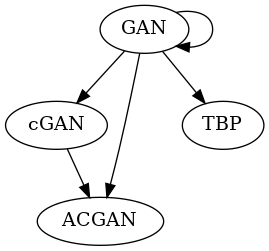

## 目的
- 引用関係を図にする
<br>

## 具体的には下の情報を入力すると

```
papers = [
        {'title':'Generative Adversarial Nets','arxivId':'1406.2661','label':'GAN'},
        {'title':'Conditional Generative Adversarial Nets','arxivId':'1411.1784','label':'cGAN'},
        {'title':'Conditional Image Synthesis With Auxiliary Classifier GANs','arxivId':'1610.09585','label':'ACGAN'},
        {'title':'Towards Biologically Plausible Deep Learning','arxivId':'1502.04156','label':'TBP'}
    ]
```

## 下の図が出てくる
